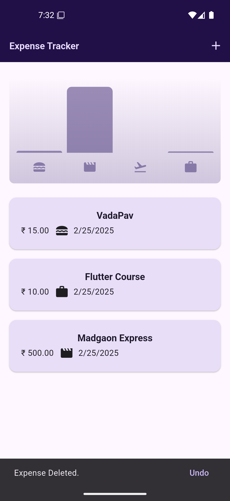

# 💸 Expense Tracker

A **simple Flutter expense tracking app** that helps users manage their expenses effectively. The app provides an intuitive interface to add, view, and analyze expenses using charts.

## ✨ Features

- **Add Expenses** – Quickly log expenses with a title, amount, and date.
- **Expense Chart** – Visualize weekly spending with a dynamic chart.
- **User-Friendly UI** – Simple and clean design for easy expense management.

## 📸 Screenshots

<p align="center">
  
  
  
</p>

## 📚 Dependencies

| Package           | Purpose                                    |
|-------------------|--------------------------------------------|
| `flutter`        | Core Flutter SDK.                         |
| `cupertino_icons` | iOS-style icons for a modern interface.   |
| `uuid`           | Generate unique IDs for expenses.         |
| `intl`           | Formatting dates and numbers.             |

### Install dependencies using:
```sh
flutter pub get
```

## Installation

1. Clone the repository:
   ```sh
   git clone https://github.com/yourusername/expense_tracker.git
   ```
2. Navigate to the project directory:
   ```sh
   cd expense_tracker
   ```
3. Run the app:
   ```sh
   flutter run
   ```
